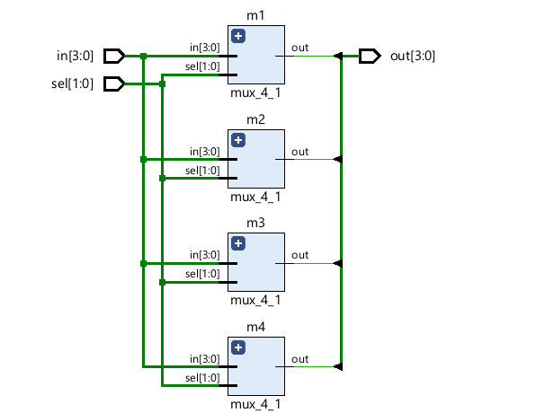

# Barrel Shift Register (Verilog)

This project implements a 4-bit barrel shift register in Verilog using 4-to-1 multiplexers. The design is tested using a simple testbench and simulated with Icarus Verilog.

## Files

- [`barrel_shift_reg.v`](barrel_shift_reg.v): Top-level module for the barrel shift register.
- [`mux_4_1.v`](mux_4_1.v): 4-to-1 multiplexer module used in the shift register.
- [`test.v`](test.v): Testbench for simulating the barrel shift register.
- [`test.vcd`](test.vcd): Value Change Dump file generated from simulation for waveform viewing.
- [`test.vvp`](test.vvp): Compiled simulation file for use with `vvp`.
- `Elaborated_Design_Vivado.png`, `waveform.png`: Images showing the design and simulation results.

## How It Works

- The barrel shift register rotates the input bits based on the 2-bit `sel` signal.
- Each output bit is selected using a 4-to-1 multiplexer with appropriately rotated inputs.

## Simulation

### Prerequisites

- [Icarus Verilog](http://iverilog.icarus.com/)
- [GTKWave](http://gtkwave.sourceforge.net/) (for waveform viewing)

### Steps

1. **Compile the design and testbench:**
    ```sh
    iverilog -o test.vvp test.v
    ```

2. **Run the simulation:**
    ```sh
    vvp test.vvp
    ```

3. **View the waveform:**
    ```sh
    gtkwave test.vcd
    ```

## Design Overview

- **barrel_shift_reg**: Instantiates four [`mux_4_1`](mux_4_1.v) modules to implement the shift logic.
- **mux_4_1**: Selects one of four input bits based on the `sel` signal.

## Design Images

### Elaborated Design



### Simulation Waveform

